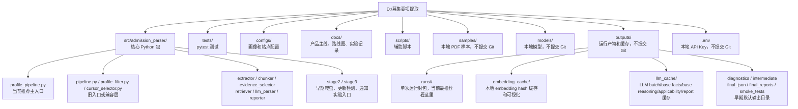
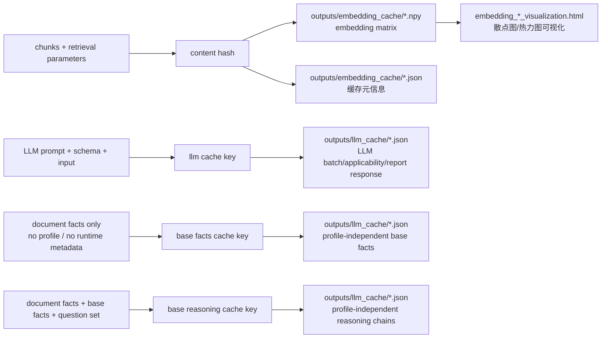

# Project Architecture

本文整理当前仓库里的源码、脚本、本地资产、缓存和运行产物。

## 文件层级

## 主 pipeline

```mermaid
flowchart LR
    pdf["samples/*.pdf"]
    profile["Applicant Profile\nYAML / CLI / interactive"]
    extract["extractor.py\nPyMuPDF + pdfplumber"]
    clean["02_clean.md"]
    chunk["chunker.py\n03_chunks.json"]
    index["document_index.py\n03_document_index.json"]
    refs["reference_resolver.py\n03_reference_links.json"]
    selector["evidence_selector.py\n04_evidence_selector_chunks.json\n04_evidence_selector_decisions.json"]
    retrieval["vector_retriever.py\nngram / local embedding\n05_retrieved_chunks.json"]
    recursive["recursive_retriever.py\n05_reference_expanded_chunks.json"]
    batches["category_router.py\n06_llm_batches.json"]
    llm["llm_parser.py\ncategory-batched LLM JSON"]
    merge["merger.py + validator.py\n07_structured.json"]
    rule_report["reporter.py\n08_report.md"]
    base["applicability.py\n09_base_facts.json"]
    reason["applicability.py\n09_base_reasoning_chains.json"]
    app["applicability.py\n09_applicability.json"]
    llm_report["applicability.py\n10_llm_report.md"]

    pdf --> extract --> clean --> chunk
    chunk --> index --> refs
    profile --> selector
    chunk --> selector
    selector --> retrieval
    profile --> retrieval
    refs --> recursive
    retrieval --> recursive
    recursive --> batches
    batches --> llm --> merge
    merge --> rule_report
    merge --> base --> reason --> app --> llm_report
    profile --> app
    base --> llm_report
    reason --> llm_report
```

## 核心源码职责

| 文件 | 当前职责 | 状态 |
| --- | --- | --- |
| `profile_pipeline.py` | 推荐主入口，把 PDF、profile、检索、LLM、报告串起来 | 主线 |
| `extractor.py` | PDF 文本/表格抽取，使用 PyMuPDF + pdfplumber | 主线 |
| `chunker.py` | Markdown 切 chunk，包含 page boundary split | 主线 |
| `profile_input.py` | 申请者画像输入，支持 YAML/JSON、CLI、interactive | 主线 |
| `evidence_selector.py` | profile-guided evidence selection | 主线 |
| `vector_retriever.py` | n-gram 和 local embedding 检索 | 主线 |
| `document_index.py` | 构建 chunk/page/section 索引 | 主线 |
| `reference_resolver.py` | 识别文档内引用，例如 下記(1) | 主线 MVP |
| `recursive_retriever.py` | direct/recursive 引用扩展 | 主线 MVP |
| `retrieval_crosscheck.py` | 生成关键词/检索交叉验证 HTML/JSON/MD | 诊断工具 |
| `category_router.py` | 把 chunks 路由到材料、英语、费用、考试等 category | 主线 |
| `schemas.py` | Pydantic 输出 schema | 主线 |
| `llm_parser.py` | category-batched parallel LLM extraction 和 LLM cache | 主线 |
| `merger.py` | 多 batch JSON 合并、去重、warning 整理 | 主线 |
| `validator.py` | 日期、金额、结构化 warning 等校验 | 主线 |
| `applicability.py` | profile-independent base facts/base reasoning chains、applicant-specific applicability pass 和 LLM report | 主线 MVP |
| `reporter.py` | 本地规则型 Markdown report | 保留 |
| `cursor_selector.py` | 旧 cursor API 的兼容 wrapper | legacy compatibility |
| `pipeline.py` | 不带 profile 的旧通用抽取入口 | legacy |
| `profile_filter.py` | cursor/evidence selector 前的旧 profile filter | legacy |
| `profiler.py` | 早期相关页筛选和页面 profile | 仍被旧入口使用 |
| `stage2/` | 爬虫、下载、SQLite、更新检测实验 | future/experimental |
| `stage3/` | diff、通知、scheduler 实验 | future/experimental |

## 脚本和配置

| 路径 | 用途 | Git 状态 |
| --- | --- | --- |
| `scripts/visualize_embeddings.py` | 把 `.npy` embedding 缓存生成 HTML 可视化 | 提交 |
| `configs/applicant_profile.example.yaml` | 示例申请者画像 | 提交 |
| `configs/universities.yaml` | 早期大学站点配置示例 | 提交 |
| `.env.example` | API 配置模板 | 提交 |
| `.env` | 真实 API key | 不提交 |
| `test_env.py` | PDF/LLM 环境检查脚本 | 提交 |

## 本地资产

| 路径 | 内容 | 说明 |
| --- | --- | --- |
| `samples/` | PDF 样本，例如 `2027_4_2026_9_master.pdf` | 不提交 Git |
| `models/bge-m3/` | 本地 BAAI/bge-m3 模型 | 不提交 Git |
| `outputs/` | 运行产物、缓存、报告 | 不提交 Git |
| `backups/` | 实验备份 | 不提交 Git |
| `logs/` | 日志 | 不提交 Git |

## 单次 run 产物

```mermaid
flowchart TB
    run["outputs/runs/<run_name>/"]
    run --> p1["01_page_profile_summary.json\n页级 profile 摘要"]
    run --> p2["02_clean.md\n清洗后的 Markdown"]
    run --> p3["03_chunks.json\nchunk 切分结果"]
    run --> p3b["03_document_index.json\n文档索引"]
    run --> p3c["03_reference_links.json\n文档内引用"]
    run --> p4["04_evidence_selector_chunks.json\nprofile 选中的证据"]
    run --> p4b["04_evidence_selector_decisions.json\n每个 chunk 的保留/丢弃原因"]
    run --> p5["05_retrieved_chunks.json\n检索补充 chunks"]
    run --> p5b["05_retrieval_decisions.json\n检索打分和来源"]
    run --> p5c["05_reference_expanded_chunks.json\n引用扩展补充"]
    run --> p6["06_llm_batches.json\n按 category 打包后的 API 请求计划"]
    run --> p7["07_structured.json\nLLM JSON 合并后的结构化事实"]
    run --> p8["08_report.md\n本地 reporter 规则型报告"]
    run --> p8b["09_base_facts.json\n不依赖申请者画像的文档事实整理"]
    run --> p8c["09_base_reasoning_chains.json\n不依赖申请者画像的文档级逻辑链"]
    run --> p9["09_applicability.json\nLLM 适用性判断"]
    run --> p10["10_llm_report.md\nLLM 自然语言报告"]
    run --> cross["07_retrieval_crosscheck.html/json/md\n检索交叉验证，dry-run 常见"]
```

当前最推荐使用 `--run-dir outputs/runs/<run_name>`，因为它会把同一次运行的中间产物和最终产物封在一个目录中。

注意：部分旧 run 里仍叫 `04_cursor_chunks.json` / `04_cursor_decisions.json`。这是历史命名，语义上等价于当前的 `evidence_selector` 产物。

## 缓存

当前缓存还不是完整 index 管理层：

- embedding cache 是按输入文本集合 hash 保存 `.npy` 矩阵。
- LLM cache 是按 prompt/schema/input 保存 response。
- base facts cache 只看文档事实，不看申请者画像，因此 TOEIC/TOEFL 等 profile 变化可以复用同一份文档事实整理。
- base reasoning chains cache 只看文档事实、base facts 和固定问题集，不看申请者画像；它回答通用招生规则问题，并保留 reasoning steps/evidence/uncertainty。
- 未来需要 document-level manifest，把 `pdf_hash`、`chunker_version`、`prompt_version`、`schema_version` 统一起来。

## Git 管理边界

提交到 GitHub：

- `README.md`
- `docs/`
- `configs/`
- `scripts/`
- `src/`
- `tests/`
- `pyproject.toml`
- `.env.example`

不提交到 GitHub：

- `.env`
- `.venv/`
- `samples/`
- `models/`
- `outputs/`
- `backups/`
- `logs/`
- `__pycache__/`
- `.pytest_cache/`
- `.ruff_cache/`
- `*.egg-info/`

## 当前整理建议

短期建议继续保持这个边界：

1. 新功能优先接入 `profile_pipeline.py`。
2. 新的中间产物优先写入 `outputs/runs/<run_name>/`。
3. 旧目录 `outputs/final_json`、`outputs/final_reports`、`outputs/intermediate`、`outputs/diagnostics` 暂时保留，但不作为新实验的主要查看入口。
4. `cursor_*` 旧命名只做兼容，不再作为新代码命名。
5. `stage2/`、`stage3/` 暂时作为后续产品化方向的实验区，不混进当前 admission extraction 主线。
